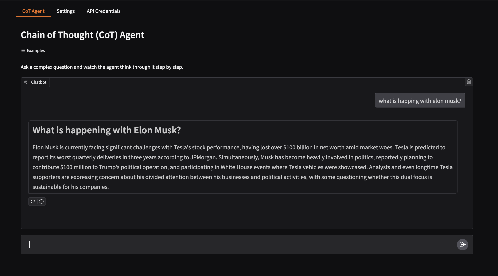
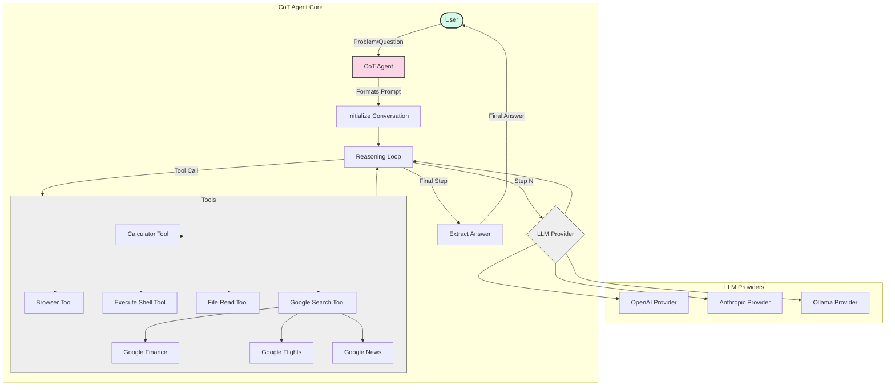

# 🧠 Chain of Thought (CoT) Agent


> **A flexible, multi-provider Chain of Thought reasoning framework with tool-calling capabilities**



## 🚀 Overview

**CoT Agent** is a powerful framework that enables large language models (LLMs) to solve complex problems through step-by-step reasoning. By implementing Chain of Thought (CoT) methodology, models can break down problems, show their work, and leverage external tools to achieve more accurate and reliable results.

```
📝 Problem → 🤔 Step-by-Step Reasoning → 🔧 Tool Usage → 💡 Final Answer
```

This implementation supports multiple LLM providers (OpenAI, Anthropic, Ollama) and includes a range of tools that extend the capabilities of language models beyond simple text generation.

## ✨ Key Features

- **Multi-Provider Support**: Works with OpenAI (GPT-4), Anthropic (Claude), and Ollama (Llama, Mistral) models
- **Tool Integration**: Extends LLM capabilities with various tools:
  - 🔢 Calculator for mathematical operations
  - 🌐 Browser control for web interactions
  - 💻 Shell command execution
  - 📂 File system operations
  - 🔍 Google Search integration with specialized tools:
    - 📈 Google Finance for financial data
    - ✈️ Google Flights for travel information
    - 📰 Google News for current events
- **Step-by-Step Reasoning**: Encourages models to break down problems into logical steps
- **Modular Architecture**: Easily extend with custom tools and LLM providers
- **Interactive Problem Solving**: Watch the agent's reasoning process unfold in real-time
- **Gradio Web Interface**: User-friendly UI for interacting with the agent

## 📋 Requirements

- Python 3.8+
- Required Python packages:
  - For OpenAI: `openai>=1.0.0`
  - For Anthropic: `anthropic>=0.11.0`
  - For Ollama: `ollama>=0.1.0`
  - For browser functionality: `playwright>=1.40.0`
  - For Google search: `serpapi>=0.1.0`
  - For UI: `gradio`
  - Utility packages: `python-dotenv>=1.0.0`, `requests>=2.31.0`

## 🔧 Installation

```bash
# Clone the repository
git clone https://github.com/yourusername/cot-agent.git
cd cot-agent

# Create and activate virtual environment (optional but recommended)
python -m venv venv
source venv/bin/activate  # On Windows: venv\Scripts\activate

# Install dependencies
pip install -r requirements.txt

# Set up environment variables (create a .env file with your API keys)
echo "OPENAI_API_KEY=your_openai_key" > .env
echo "ANTHROPIC_API_KEY=your_anthropic_key" >> .env
echo "SERPAPI_KEY=your_serpapi_key" >> .env
```

## 🛠️ Usage

### Commandline

```bash
python cot_agent.py

CoT Agent Chat Interface
========================
Type your questions or use commands (type /help for available commands)
Current configuration: Provider: anthropic, Model: claude-3-7-sonnet-20250219

You: what are teh top stories on hackernews?

Answer:
Based on the findings from the Hacker News website, here are the current top stories on Hacker News:

1. The Startup CTO's Handbook (514 points)
2. The DuckDB Local UI (499 points)
3. Gemini Robotics brings AI into the physical world (423 points)
4. Gemma 3 Technical Report (362 points)
5. Peer-to-peer file transfers in the browser (332 points)
6. The Future Is Niri (265 points)
7. Open-UI: Maintain an open standard for UI (251 points)
8. The Insecurity of Telecom Stacks in the Wake of Salt Typhoon (228 points)
9. The 2005 Sony Bravia ad (210 points)
10. I stopped everything and started writing C again (177 points)

These stories reflect the current interests of the tech community on Hacker News, spanning topics from AI and programming tools to technical reports and open standards.
```

### Code

```python
from cot_agent import CoTAgent, OpenAIProvider, CalculatorTool

# Initialize provider and agent
provider = OpenAIProvider(model_name="gpt-4o")
calculator = CalculatorTool()

# Create agent with tools
agent = CoTAgent(
    provider=provider,
    tools=[calculator],
    max_steps=5
)

# Solve a problem
answer = agent.solve_problem("What is the square root of 144 plus the cube root of 27?")
print(f"Final Answer: {answer}")
```

### Gradio Web Interface

The project includes a Gradio-based web interface for easy interaction:

```bash
# Start the Gradio web interface
python gradio_cot_agent.py
```

This will launch a web interface where you can:

- Select your preferred LLM provider and model
- Configure API keys
- Enable/disable various tools
- Submit problems and see the agent's step-by-step reasoning
- Watch the agent's thought process in real-time

## 🧩 Architecture

The CoT Agent is built with a modular architecture consisting of:

1. **LLM Providers**: Abstract interface for different LLM services
   - `OpenAIProvider`: For GPT models (gpt-4o, gpt-4, gpt-3.5-turbo, etc.)
   - `AnthropicProvider`: For Claude models (claude-3-opus, claude-3-sonnet, etc.)
   - `OllamaProvider`: For open-source models via Ollama
2. **Tools**: Extensible set of external capabilities

   - `CalculatorTool`: Mathematical operations
   - `BrowserTool`: Web browsing and interaction
   - `ExecuteShellTool`: Shell command execution
   - `FileReadTool`: File system operations
   - `GoogleSearchTool`: Web search integration
   - `GoogleFinanceTool`: Financial data retrieval
   - `GoogleFlightsTool`: Flight information
   - `GoogleNewsTool`: News article retrieval

3. **CoTAgent**: Core reasoning engine
   - Manages conversation context
   - Handles tool calling
   - Implements step-by-step reasoning flow
   - Extracts final answers

### System Architecture Diagram



## 🌟 Advanced Examples

### Multi-Tool Problem Solving

```python
from cot_agent import (
    CoTAgent, AnthropicProvider, CalculatorTool,
    GoogleSearchTool, FileReadTool
)

# Initialize provider with Claude
provider = AnthropicProvider(model_name="claude-3-7-sonnet-20250219")

# Create agent with multiple tools
agent = CoTAgent(
    provider=provider,
    tools=[CalculatorTool(), GoogleSearchTool(), FileReadTool()],
    max_steps=10
)

# Solve a complex problem requiring multiple tools
problem = """
Analyze the growth rate of Tesla's stock price over the last year.
Calculate the average monthly growth rate and compare it to the S&P 500 index.
If the data shows Tesla outperforming the index, explain possible reasons.
"""

answer = agent.solve_problem(problem)
print(f"Analysis Results:\n{answer}")
```

### Custom Tool Creation

```python
from cot_agent.tools import Tool
from cot_agent import CoTAgent, OllamaProvider

# Create a custom weather tool
class WeatherTool(Tool):
    def __init__(self):
        super().__init__(
            name="weather",
            description="Get current weather for a location",
            parameters={
                "type": "object",
                "properties": {
                    "location": {
                        "type": "string",
                        "description": "City name or coordinates"
                    }
                },
                "required": ["location"]
            }
        )

    def execute(self, location):
        # Implement weather API call
        # This is a simplified example
        return f"Weather data for {location}: Sunny, 25°C"

# Use the custom tool with Ollama
provider = OllamaProvider(model_name="llama3.2")
agent = CoTAgent(provider=provider, tools=[WeatherTool()])
```

## 🔄 Supported LLM Providers

| Provider  | Models                                   | Features                                     |
| --------- | ---------------------------------------- | -------------------------------------------- |
| OpenAI    | GPT-4o, GPT-4-Turbo, GPT-3.5-Turbo, etc. | Advanced tool use, function calling          |
| Anthropic | Claude 3 Opus, Sonnet, Haiku, Claude 2   | High-quality reasoning, multi-content blocks |
| Ollama    | Locally running models via Ollama API    | Local deployment, no external API required   |

## 🙌 Contributing

Contributions are welcome! Feel free to:

- 🐛 Report bugs and issues
- ✨ Suggest new features or enhancements
- 🛠️ Submit pull requests with improvements
- 📖 Improve documentation

## 📜 License

This project is licensed under the MIT License - see the LICENSE file for details.

## 🔮 Roadmap

- [ ] Support for multi-modal inputs (images, audio)
- [ ] Memory management for long-running sessions
- [ ] Agent self-improvement and meta-cognition
- [ ] Parallel tool execution for efficiency
- [ ] Additional specialized tools integration

---

<p align="center">
  <b>Built with 💻 code and 🧠 intelligence</b>
</p>
